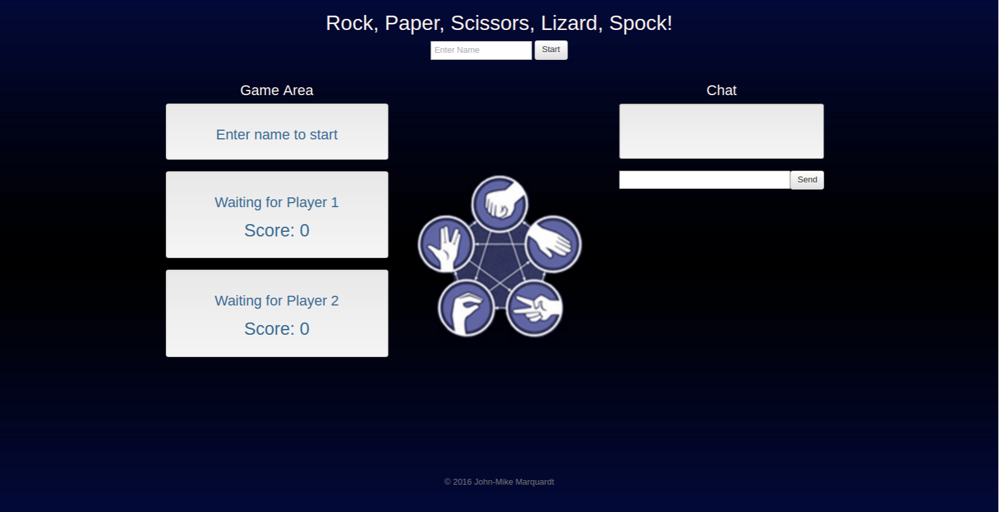

# RPS-Multiplayer
Rock, Paper, Scissors, Lizard, Spock-A multiplayer online game written in Javascript utilizing Firebase for player interaction and chat.

## Screenshots
### Desktop

### Mobile

## Technologies Used
* HTML
* CSS
* Sass
* Twitter Bootstrap
* JavaScript
* jQuery
* Firebase

## Overall Concept
This is a two player Rock, Paper, Scissors, Lizard, Spock Game where players 1 and 2 can play against each other online.  Players 1  and 2 each have a separate view on their browser, with variables being updated from Firebase using jQuery.  Firebase is also used to host the chat window, which players can use to send each other messages in real time. 

## Built with
* Sublime
* Google Firebase
* Twitter Bootstrap
* Heroku

## Notes
I created this project for class in order to learn Firebase.  My main focus at the time was the JavaScript and Firebase, not so much on the style in order to get a functional MVP in by the deadline.  I will definitely come back to this and re-style. :)

## Future Improvements
* Overall style and images
* Leaderboard
* Save User info
* Game selector-(Rock, Paper, Scissors), (Rock, Paper, Scissors, Lizard, Spock) and other variations

## Author
John-Mike Marquardt @codemarq 

### Acknowledgements
